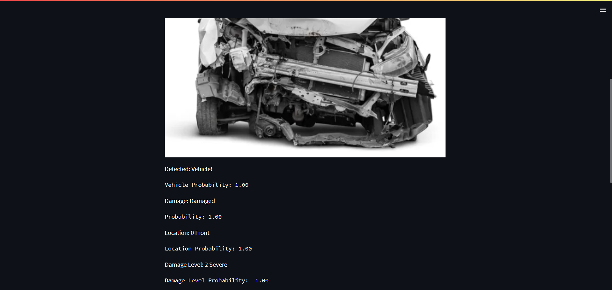
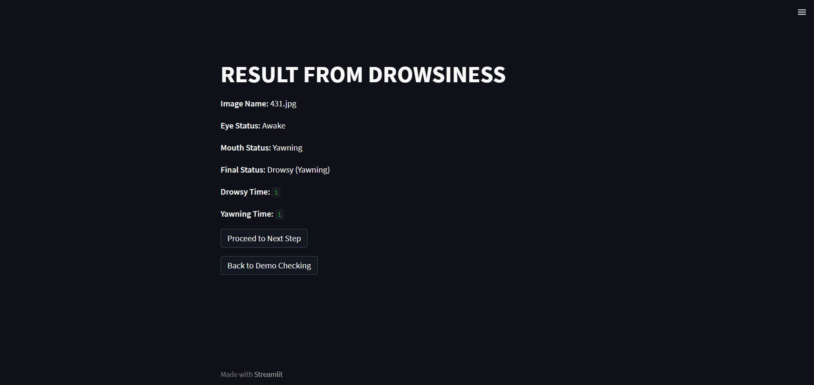

# Enhancing Vehicle Inspection: A Comprehensive Approach to Drowsiness Monitoring and Damage Detection 🚗💤🔍

This project addresses the rising number of vehicle-related incidents and the increasing pressure on insurance systems due to inefficient claim processing and leakage. By leveraging Artificial Intelligence (AI) techniques and computer vision, this solution aims to enhance vehicle safety through two core modules:

- **Driver Drowsiness Detection**
- **Vehicle Damage Assessment**

The system integrates **MediaPipe**, **pretrained Convolutional Neural Network (CNN) models** like **MobileNet, VGG16, VGG19, and DenseNet**, and a **Streamlit-based user interface** to offer real-time monitoring, smart detection, and insurance estimation functionalities.

## 🧭 Application Flow: Enhancing Vehicle Inspection System
The application follows a guided and interactive flow for users, ensuring all major components (registration, damage detection, drowsiness monitoring) are handled seamlessly:
#### 1. 🔐 Login / Registration Page

New Guest: Register by entering details like name, contact, address, etc.

Existing Guest: Login using phone/email.

Once registered, proceed to the next step.

#### 2. ✅ Initial Confirmation Page
The user is asked:
"Has your vehicle been in an accident?"

Options:

Yes → Redirected to Car Damage Detection module.

No → Redirected to Drowsiness Detection module.

#### 3A. 🚗 If 'Yes' (Car Damage Detection)
Upload a car image or use a webcam snapshot.

 

The system:
- Detects if a car is present in the image.
- If no car is detected: Shows not a vehicle.

- If car is detected:
  Assesses the damage using pretrained models (VGG16, VGG19, DenseNet121, MobileNet).
  Classifies damage severity.
  Estimates repair cost and part replacement costs.

#### 3B. 😴 If 'No' (Drowsiness Detection)

- Click on demo for checking how to use the real time monitoring , or click on automatic for direct result on the last uploaded image off the user

- Activates webcam for real-time monitoring.
- Uses MediaPipe for facial landmark tracking.
- Alerts the driver (visual/audio) if signs of drowsiness are detected.
- After which the results are shown

#### 4. 💸 Cost Estimation Module
User provides:
- Vehicle Name
- Model Name
- Year of Manufacture
- Selects Damaged Parts (added to cart)

The system:
Calculates total repair cost including replacement parts
Shows a summary breakdown

#### 5. 🧠 Scenario Generation
Final report is compiled using all prior inputs (drowsiness + damage + cost).

Uses LLM API key to:
- Generate a natural language scenario summary
- Highlight cause, severity, and suggested actions

#### 6. 📄 Executive Report Output
- Guest Details
- Detection Results
- Repair Cost Estimate
- AI-Generated Accident/Drowsiness Scenario
- Insurance Advice / Safety Tips
- Downloadable PDF format report comprising the above

## Key Features

### 🔹 Drowsiness Detection using MediaPipe
- Uses facial landmark detection for continuous monitoring via webcam.
- Detects signs of drowsiness based on eye and mouth movement.
- Triggers audio-visual alerts to notify drivers in real-time.
- Supports both real-time and image-upload-based detection.

### 🔹 Vehicle Damage Detection using CNN Models
- Accepts car images from users to assess external damage.
- Applies preprocessing (resizing, normalization, augmentation).
- Compares results across multiple pretrained CNNs: **VGG16, VGG19, DenseNet121, and MobileNet**.
- Classifies damage types and estimates severity and repair cost.
- Includes analysis of replacement part costs for insurance estimates.

## Future Scope

- Real-time IoT-based vehicle status monitoring.
- Wearable tech integration for health and fatigue tracking.
- AI-based injury severity estimation during collisions.
- Integration with insurance platforms for automated claims.

## Tech Stack

- **Frontend**: Streamlit
- **Backend**: Python (OpenCV, MediaPipe, TensorFlow/Keras)
- **Models**: MobileNet, VGG16, VGG19, DenseNet121 (Transfer Learning)
- **Utilities**: Numpy, Pandas, Matplotlib

## UseCase Diagram

 
This use case diagram shows how different users interact with core features of the vehicle safety system. The User drives the main safety-related actions (drowsiness & damage detection), the System automates alerts, Admin maintains the platform, and Insurance benefits from the automated documentation for claim support.

#### 🎯 Actors in the Diagram:
- User : General end-users like drivers or car owners. They can initiate and interact with multiple system functionalities.
- System : Refers to automated processes or background components that support the app (e.g., sensors, models, back-end modules). Handles backend functions like alert generation or automatic logging.
- Insurance : Represents insurance providers who interact with the system for claim support. May receive generated reports and use damage assessments for claim validation.
- Admin : The administrative user who manages the system. Oversees and supports all major operations for maintenance and control.

#### ✅ Use Cases (Functionalities): 
- Drowsiness Detection : Triggered by the user; uses AI (e.g., MediaPipe) to monitor fatigue and provides real-time alerts.
- Damage Assessment : Initiated by the user; employs pretrained CNNs (e.g., VGG16, VGG19) to detect and classify vehicle damage.
- Report Generation : Accessible by user/admin; compiles detection results into an executive report, usable by insurance.
- Alert System : Activated by the system; sends real-time alerts to the user and optionally to the admin.
- Admin Management : Handled by the admin; covers user control, configuration, and system updates.
- Claim Support : Used by insurance; assists in validating and processing claims based on system-generated reports.

## Conclusion

This project delivers an end-to-end AI-powered Vehicle Inspection and Safety Monitoring System that seamlessly integrates real-time detection, cost estimation, and scenario generation into a single, user-friendly Streamlit application. By leveraging MediaPipe for drowsiness analysis and pretrained deep learning models like VGG16, VGG19, DenseNet121, and MobileNet for vehicle damage assessment, the system offers a robust solution for improving road safety and streamlining post-accident procedures.

With the addition of automated repair cost estimation, guest management, and natural language scenario reporting, the platform provides value not only to individual users but also to sectors like insurance, automotive service, and fleet management. This project demonstrates how the thoughtful application of AI, combined with an intuitive interface, can help reduce accident risks, minimize claim leakages, and enhance decision-making in critical situations.

